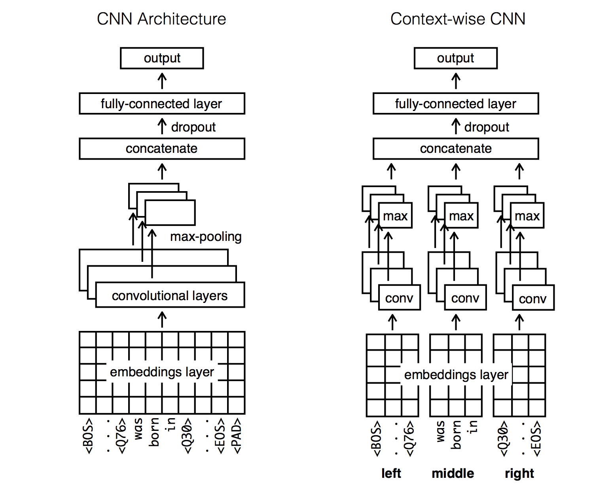
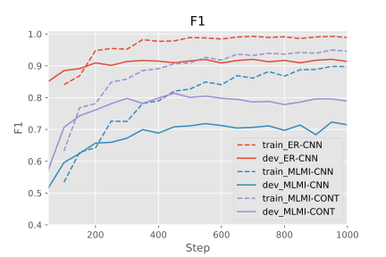
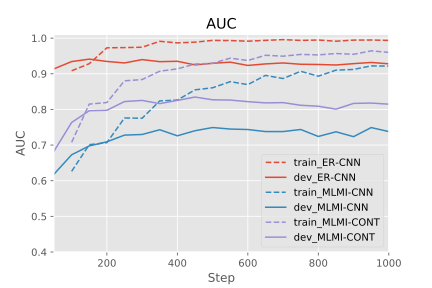
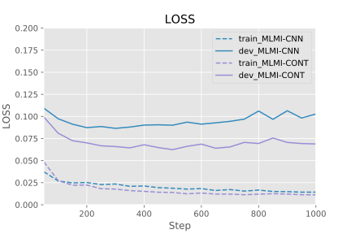
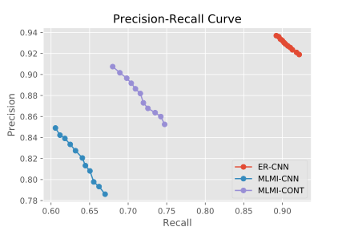
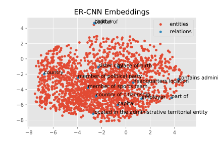
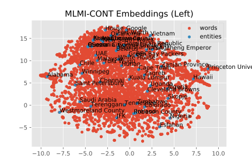
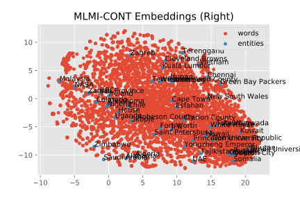

# Convolutional Neural Network for Relation Extraction

**Note:** This project is mostly based on https://github.com/yuhaozhang/sentence-convnet

---


## Requirements

- [Python 2.7](https://www.python.org/)
- [Tensorflow](https://www.tensorflow.org/) (tested with version <strike>0.10.0rc0</strike> -> 1.0.1)
- [Numpy](http://www.numpy.org/)

To download wikipedia articles (`distant_supervision.py`)

- [Beautifulsoup](https://www.crummy.com/software/BeautifulSoup/bs4/doc/)
- [Pandas](http://pandas.pydata.org/)
- [Stanford NER](http://nlp.stanford.edu/software/CRF-NER.shtml)
    *Path to Stanford-NER is specified in `ner_path` variable in `distant_supervision.py`

To visualize the results (`visualize.ipynb`)

- [Matplotlib](https://matplotlib.org/)
- [Scikit-learn](http://scikit-learn.org/)


## Data
- `data` directory includes preprocessed data:
    ```
    cnn-re-tf
    ├── ...
    ├── word2vec
    └── data
        ├── er              # binay-classification dataset
        │   ├── source.txt      #   source sentences
        │   └── target.txt      #   target labels
        └── mlmi            # multi-label multi-instance dataset
            ├── source.att      #   attention
            ├── source.left     #   left context
            ├── source.middle   #   middle context
            ├── source.right    #   right context
            ├── source.txt      #   source sentences
            └── target.txt      #   target labels
    ```    
    To reproduce: 
    ```
    python ./distant_supervision.py
    ```
    
- `word2vec` directory is empty. Please download the Google News pretrained vector data from 
[this Google Drive link](https://drive.google.com/file/d/0B7XkCwpI5KDYNlNUTTlSS21pQmM/edit), 
and unzip it to the directory. It will be a `.bin` file.


## Usage
### Preprocess

```sh
python ./util.py
```
It creates `vocab.txt`, `ids.txt` and `emb.npy` files.

### Training

- Binary classification (ER-CNN):
    ```sh
    python ./train.py --sent_len=3 --vocab_size=11208 --num_classes=2 --train_size=15000 \
    --data_dir=./data/er --attention=False --multi_label=False --use_pretrain=False
    ```

- Multi-label multi-instance learning (MLMI-CNN):
    ```sh
    python ./train.py --sent_len=255 --vocab_size=36112 --num_classes=23 --train_size=10000 \
    --data_dir=./data/mlmi --attention=True --multi_label=True --use_pretrain=True
    ```
    
- Multi-label multi-instance Context-wise learning (MLMI-CONT):
    ```sh
    python ./train_context.py --sent_len=102 --vocab_size=36112 --num_classes=23 --train_size=10000 \
    --data_dir=./data/mlmi --attention=True --multi_label=True --use_pretrain=True
    ```

**Caution:** A wrong value for input-data-dependent options (`sent_len`, `vocab_size` and `num_class`) 
may cause an error. If you want to train the model on another dataset, please check these values.


### Evaluation

```sh
python ./eval.py --train_dir=./models/mlmi-cont
```
Replace the `--train_dir` with the output from the training.


### Run TensorBoard

```sh
tensorboard --logdir=./models/mlmi-cont
```


## Architecture




## Results

|         |   P  |   R  |   F  |  AUC |
|--------:|:----:|:----:|:----:|:----:|
|  ER-CNN |0.9290|0.9040|0.9163|0.9275|
| MLMI-CNN|0.8205|0.6406|0.7195|0.7424| 
|MLMI-CONT|0.8819|0.7158|0.7902|0.8156|










* As you see above, these models somewhat suffer from overfitting ...

## References

* http://github.com/yuhaozhang/sentence-convnet
* http://github.com/dennybritz/cnn-text-classification-tf
* http://www.wildml.com/2015/12/implementing-a-cnn-for-text-classification-in-tensorflow/
* http://tkengo.github.io/blog/2016/03/14/text-classification-by-cnn/
* Adel et al. [Comparing Convolutional Neural Networks to Traditional Models for Slot Filling](http://arxiv.org/abs/1603.05157) NAACL 2016
* Nguyen and Grishman. [Relation Extraction: Perspective from Convolutional Neural Networks](http://www.cs.nyu.edu/~thien/pubs/vector15.pdf) NAACL 2015
* Lin et al. [Neural Relation Extraction with Selective Attention over Instances](http://www.aclweb.org/anthology/P/P16/P16-1200.pdf) ACL 2016
